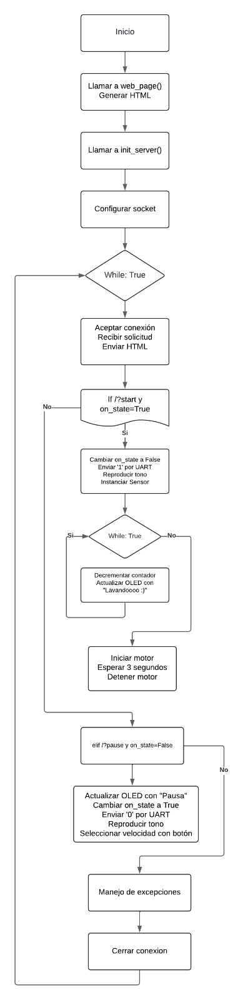
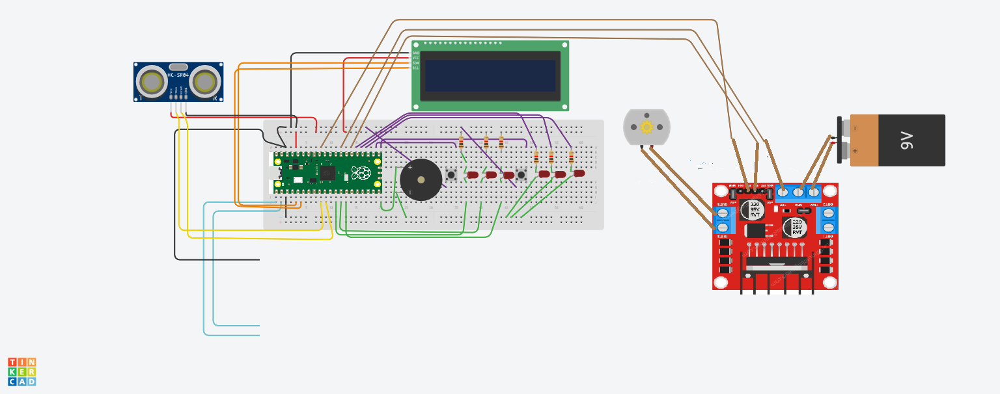

# Panel de Control para Lavadora  

Este proyecto implementa un panel de control funcional para una lavadora, utilizando una Raspberry Pi Pico, sensores, un motor controlado con un driver L298N, una pantalla OLED y una interfaz web capaz de iniciar y pausar el ciclo de lavado.

El sistema integra conceptos de electrónica digital, sistemas embebidos, comunicación serial y control de procesos, replicando el flujo real de una lavadora doméstica.

## Vision General

El proyecto reproduce el funcionamiento logico y fisico del panel de una lavadora, donde:

- Un servidor web en la Raspberry Pi Pico permite iniciar y pausar el ciclo.  
- La segunda Pico ejecuta la logica de sensores, motor, OLED y buzzer.  
- La comunicacion entre ambas placas ocurre por UART.  
- El motor se controla mediante un driver L298N, simulando el lavado real.  
- El sistema mide el nivel de agua con un sensor ultrasonico (HC-SR04).  
- Se muestran mensajes del ciclo en un display OLED (estado, pausa, lavado).  
- Se generan alertas auditivas con un buzzer.


## Arquitectura del Sistema

### 1. Interfaz Web
A través de una página simple con dos botones:

- Inicio  
- Pausa  

El usuario controla la lavadora desde cualquier navegador.

### 2. Servidor Web (Pico #1)
- Atiende solicitudes HTTP.  
- Determina si el usuario inicia o pausa el ciclo.  
- Envía comandos por UART a la Pico encargada del hardware.  
- Mantiene la variable global `on_state`.

### 3. Lógica de Lavado (Pico #2)
- Interpreta los comandos UART.  
- Mueve el motor por tiempos definidos.  
- Actualiza la pantalla OLED durante el proceso.  
- Maneja el buzzer para emitir alertas.  
- Usa el sensor ultrasónico para el control de llenado (si está implementado).


## Diagrama de Flujo



## Esquematico del Circuito



## Componentes del Sistema

- Raspberry Pi Pico (x2)  
- Sensor ultrasonico HC-SR04  
- Pantalla OLED SSD1306  
- Driver de motor L298N  
- Motor DC  
- Buzzer pasivo  
- LEDs y resistencias  
- Pulsadores  
- Protoboard  
- Cables jumper  
- Bateria de 9V  

## Funcionamiento General del Ciclo

El usuario abre la página web generada por la Pico.

### Al presionar Inicio:
- Se envía '1' por UART.  
- Se reproduce un tono.  
- La pantalla OLED muestra “Lavandoooo :)”.  
- Inicia un ciclo de movimiento del motor.  
- La lógica repite este flujo hasta completar el contador interno.  
- Los botones físicos de selección de modo quedan bloqueados mientras el ciclo está en ejecución.

### Al presionar Pausa:
- Se envía '0' por UART.  
- La pantalla OLED muestra “Pausa”.  
- El motor se detiene.  
- El sistema permite seleccionar entre los diferentes modos de lavado mediante los botones físicos.  
- La ejecución permanecerá detenida hasta recibir un nuevo comando.

El sistema continúa ciclando entre inicio y pausa según las solicitudes web enviadas por el usuario.

## Instalacion y Uso

1. Clona el repositorio.  
2. Conecta los componentes segun el esquema.  
3. Carga `boot.py` y `main.py` en las Pico.  
4. Conecta RX-TX y GND entre ambas placas.  
5. Ingresa la IP generada en el navegador.  
6. Controla la lavadora con los botones.  

## Estructura del Repositorio
```
Panel-Lavadora-main/
├── main_microPico/              # Lógica principal: motor, OLED, sensores, sonidos, servidor
├── main/                        # Código auxiliar y pruebas
├── Botontareas/                 # Manejo del botón para selección de tareas o funciones
├── Botontemperatura/            # Manejo del botón para selección de temperatura
├── botonEncendido/              # Encendido y apagado general del sistema
├── botonAgua/                   # Control de llenado de agua mediante botón
├── botonInicioPausa/            # Botón para iniciar y pausar el ciclo de lavado
├── potenciometroModosLavado/    # Lectura de potenciómetro para modos de lavado
├── include/                     # Archivos de configuración y cabeceras (entorno C/CMake)
├── pruebas/                     # Scripts y ejemplos de prueba de módulos individuales
├── CMakeLists.txt               # Configuración de compilación para entorno C/CMake
└── pico_sdk_import.cmake        # Importación del SDK de la Raspberry Pi Pico

```
## Gestión del Proyecto

El desarrollo se organizó mediante Sprints y un tablero Scrum creado en Notion, donde se administraron y priorizaron todas las tareas del proyecto.

### Sprints realizados
- **Sprint 1:** Configuración del hardware, conexiones iniciales y pruebas de botones y buzzer.  
- **Sprint 2:** Integración del sensor ultrasónico, driver L298N, motor y lógica básica de control.  
- **Sprint 3:** Implementación completa del ciclo de lavado, comunicación UART, interfaz web y documentación final.

Este proceso permitió planear, organizar y revisar el avance del sistema de manera estructurada.

### Tablero y documentación del proyecto (Notion)

Puedes consultar la planificación y organización del proyecto en el siguiente enlace:

**Notion:**  
https://www.notion.so/006212043bd34abf85a1093888ad1535?v=0278c1360381474e96957951314bba89&source=copy_link

## Autoría

Proyecto académico realizado para la materia de Microcontroladores en la UAM Cuajimalpa. Su uso está destinado a fines educativos y de referencia.

