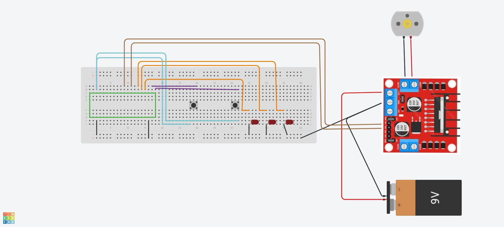

# Motor DC

## Descripcion
Este proyecto implementa el control de un motor DC mediante una interfaz de selección de velocidad con botones y retroalimentación visual mediante LEDs. El objetivo es permitir al usuario seleccionar diferentes niveles de velocidad para el motor y controlarlo con comandos simples

## Implementacion

El sistema está compuesto por tres clases principales: `Main`, `Incializacion_motor` y `Logica_motor`.

- **Main**: Clase principal que gestiona la interacción con el usuario y ejecuta el control del motor.
- **Incializacion_motor**: Clase que inicializa los pines GPIO para el motor, los LEDs y los botones.
- **Logica_motor**: Clase que contiene la lógica para seleccionar la velocidad y controlar el motor.

## Componentes
+ Microcontrolador: Raspberry Pi Pico.
+ Motor DC: Motor que se controla.
+ LEDs: Tres LEDs para indicar el nivel de velocidad seleccionado.
+ Botones: Dos botones, uno para seleccionar la velocidad y otro para confirmar la selección.
+ Pines GPIO: Para conectar los LEDs, botones y el motor.

##  Prototipo 

El prototipo consiste en conectar el motor y los LEDs a los pines GPIO del microcontrolador y utilizar los botones para seleccionar y confirmar la velocidad del motor. 
Nota:Los GPIO utilizados pueden variar dependiendo como se conecta.

## Diagrama de flujo

## Materiales

1. Motor DC, 3-6v 
2. Controlador modelo L298N
3. Raspberry pi pico W H o Raspberry pi pico
4. Protoboard
5. 2 Boton DIL Push 
6. 30 Cables M/M (Puede variar dependiendo la conexion)
7. 3 Resistencia 220 Ohms 5%

## Funcionamiento
El usuario puede seleccionar entre tres niveles de velocidad (33%, 66%, 100%) utilizando un botón. La selección se confirma con otro botón. Una vez confirmada la velocidad, el usuario puede iniciar o detener el motor mediante comandos. Los LEDs indican el nivel de velocidad seleccionado

## Pasos

1. Ejecutar el codigo en un entorno para MicroPico 

2. Conectar Componentes de hardware en base a ejemplo (Prototipo).
3. Ejecutar el código en una IDE compatible con Raspberry Pi Pico.

4. Controlar el Motor: Utilizar comandos para iniciar o detener el motor. El motor funcionará durante 2 segundos y luego se detendrá.

5. Interactua con el programa y el utiliza el  botón de selección de nivel de agua de la lavadora y confirma la velocidad manualmente.