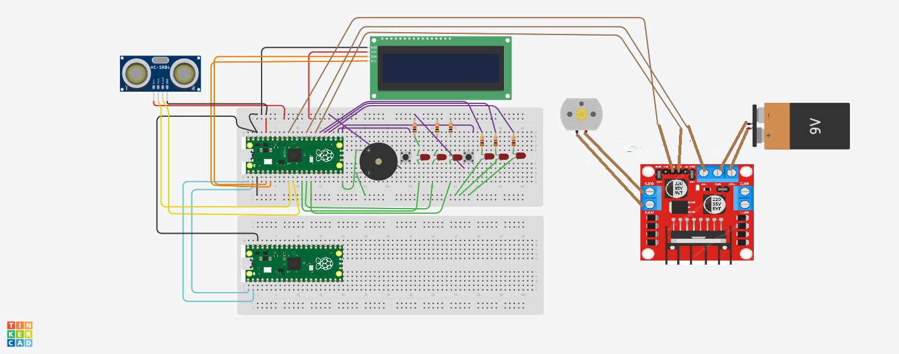

# Lavadora Controlada por Web
## Raspberry Pi Pico W

## Implementación
Este proyecto consiste en un sistema de control para una lavadora, el cual permite iniciar y pausar el proceso de lavado a través de una interfaz web. El sistema está desarrollado para ejecutarse en un microcontrolador compatible con MicroPython.

## Estructura del código
Interfaz Web:

    La interfaz web permite iniciar y pausar la lavadora mediante dos botones.
    El botón de "Inicio" envía una señal para comenzar el ciclo de lavado.
    El botón de "Pausa" envía una señal para pausar el ciclo de lavado.

Control del Motor y Display OLED:

    Durante el inicio del lavado, el sistema cuenta regresivamente (variable contador).
    La pantalla OLED muestra mensajes indicando el estado actual de la lavadora.
    El buzzer emite un tono para indicar el cambio de estado (inicio o pausa).

Comunicación Serial:

    Utiliza UART para enviar comandos a la lavadora.
    Envía '1' para iniciar y '0' para pausar el ciclo de lavado. 
## Diagrama de Flujo
 

## Materiales
- Sensor ultrasónico
- LEDs x6
- Resistencias de 220 Ohms x6
- Raspberry Pi Pico W x2 
- Zumbador pasivo
- Protoboard
- Cables Jumper Tipo Macho-Macho
- Pulsadores x2
- Motor
- Driver Motor
- Pila 

## Esquema fisico

## Funcionamiento

Resumen del Funcionamiento

Este proyecto implementa un sistema de control para una lavadora a través de una interfaz web. A continuación, se describe el funcionamiento del sistema:

    - Interfaz Web:
        -- Se proporciona una página web con dos botones: "Inicio" y "Pausa".
        -- Al presionar estos botones, se envían solicitudes al servidor para iniciar o pausar la lavadora.

    - Servidor Web:
        -- El microcontrolador actúa como un servidor web que escucha en el puerto 80.
        -- Al recibir una solicitud, se analiza la petición para determinar si se solicita iniciar o -- pausar la lavadora.

    - Control de Estados:
        -- Una variable on_state se utiliza para seguir el estado actual (iniciada o pausada).
        -- Si se recibe una solicitud de inicio (/?start) y la lavadora está pausada (on_state es True):
            --- on_state se cambia a False.
            --- Se envía un comando serial '1' a la lavadora.
            --- Se emite un tono con el buzzer.
            --- Se inicia un ciclo de cuenta regresiva en la pantalla OLED, mostrando "Lavandoooo :) ".
            --- El motor se activa durante un periodo, luego se detiene.
        -- Si se recibe una solicitud de pausa (/?pause) y la lavadora está iniciada (on_state es False):
            --- on_state se cambia a True.
            --- Se envía un comando serial '0' a la lavadora.
            --- Se emite un tono diferente con el buzzer.
            --- La pantalla OLED muestra "Pausa".

    - Pantalla OLED:
        -- Muestra mensajes para indicar el estado actual de la lavadora (lavando o en pausa).

    - Buzzer:
        -- Emite tonos audibles para indicar el cambio de estado (inicio o pausa).

    - Comunicación Serial:
        -- Utiliza UART para enviar comandos a la lavadora para iniciar ('1') o pausar ('0') el ciclo de lavado.

### Conclusión
El sistema permite controlar una lavadora de manera remota a través de una interfaz web sencilla, proporcionando una experiencia de usuario mejorada y facilitando el manejo del electrodoméstico.

## Instalación y Uso

1. Clona este repositorio en tu dispositivo.
2. Conecta los componentes a las Raspberrys Pi Pico W y a la protoboard según el esquema de conexión proporcionado.
4. Conecta los puertos RX y TX de ambas raspberry ( RX-TX y TX-RX ) y alguna tierra entre ambas.
4. Compila y carga el código de coneccion web (boot.py )en la Raspberry Pi Pico W el cual te genera la conección IP.
5. Copila y carga el código ( main.py ) e introduce en cualquier navegador la direccion ip creada anteriormente. 
6. Pulsa cualquier boton para emitir una señal.
7. Diviertete

