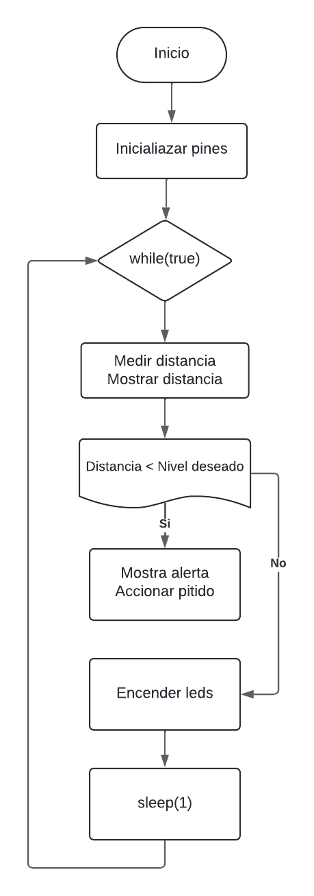
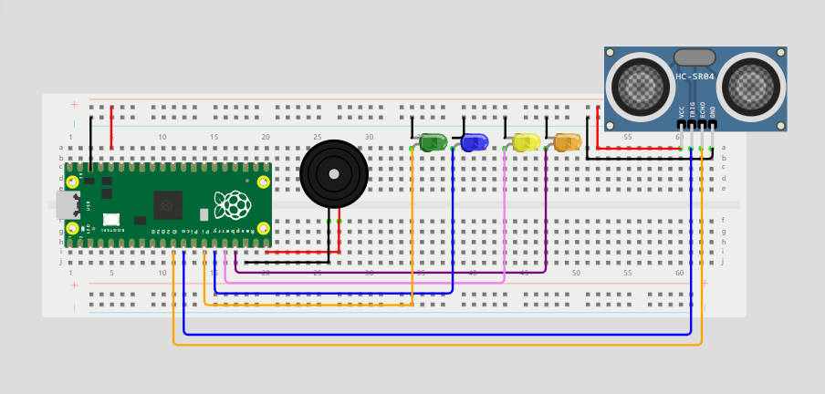

# Sensor Ultrasonico - Nivel de agua
## Implementación del Código
Este código, implementado en MicroPython para una Raspberry Pi Pico W, se encarga de medir el nivel de agua utilizando un sensor ultrasónico. Luego, exhibe los resultados mediante LEDs y un zumbador. El código está organizado en tres clases, distribuidas en diferentes archivos para facilitar la modularización y el mantenimiento del código.

## Estructura del Código
- Clase Inicialización: Inicializa todos los pines necesarios, como los pines del sensor ultrasónico, los pines de los LEDs y el pin del zumbador pasivo. Utiliza la clase Pin de la biblioteca machine para configurar los pines como entradas o salidas según sea necesario, y también utiliza la clase PWM para configurar el pin del zumbador pasivo para generar señales PWM.
- Clase SensorUltrasonico: Maneja la lógica de medición y actualización de los LEDs y el sonido del zumbador. Proporciona métodos estáticos para medir la distancia utilizando el sensor ultrasónico, emitir un sonido con el zumbador y encender los LEDs según el nivel de agua medido. Además, define valores predefinidos para el nivel deseado de agua y las distancias correspondientes.
- Clase Main: Coordina la ejecución del programa, inicializando las clases necesarias y entrando en un bucle para medir la distancia y mostrar los mensajes en pantalla. Se utiliza el sensor ultrasónico para medir la distancia, y se comprueba si la distancia medida es menor que el nivel deseado de agua. En tal caso, se emite un sonido y se encienden los LEDs.
## Digrama de flujo

## Materiales que se necesitan para implementar el prototipo:
- Sensor ultrasónico
- LEDs x4
- Resistencias de 220 Ohms x4
- Raspberry Pi Pico W
- Zumbador pasivo
- Protoboard
- Cables Jumper Tipo Macho-Macho

## Funcionalidades
El sistema tiene las siguientes funcionalidades:
- Medición de distancia mediante un sensor ultrasónico.
- Visualización del nivel de agua mediante LEDs.
- Generación de un tono en el zumbador al superar un nivel específico de agua.
- Actualización continua de la distancia y nivel de agua.

## Ejemplo de Ensamblaje del Prototipo

Sigue estos pasos para montar tu prototipo:

1. Conecta el pin Echo del sensor al pin GPIO 8 de la Raspberry Pi Pico W.
1. Conecta el pin Trigger del sensor al pin GPIO 9 de la Raspberry Pi Pico W
1. Conecta el pin VCC del sensor al pin 3V3 de la Raspberry Pi Pico W.
1. Conecta el pin GND del sensor al pin GND de la Raspberry Pi Pico W.
1. Conecta cada LED a los pines GPIO 10, 11, 12 y 13 de la Raspberry Pi Pico W respectivamente.
1. Conecta una resistencia de 220 Ohms en serie con cada LED.
1. Conecta el otro extremo de cada resistencia a la línea de tierra (GND) en la protoboard.
1. Conecta el pin de salida del zumbador al pin GPIO 15 de la Raspberry Pi Pico W.
1. Conecta el GND del zumbador al GND de la Raspberry Pi Pico W.

## Instalación y Uso
1. Clona este repositorio en tu dispositivo.
1. Conecta los componentes a la Raspberry Pi Pico W y a la protoboard según el esquema de conexión proporcionado.
1. Compila y carga el código en la Raspberry Pi Pico W.
1. En la parte alta de un vaso, aproximadamente de 12 cm, coloque el sensor ultrasónico y llénelo gradualmente con agua para observar los diferentes niveles de agua reflejados en los LEDs y si sobrepasa el nivel maximo escuchara un pitio
