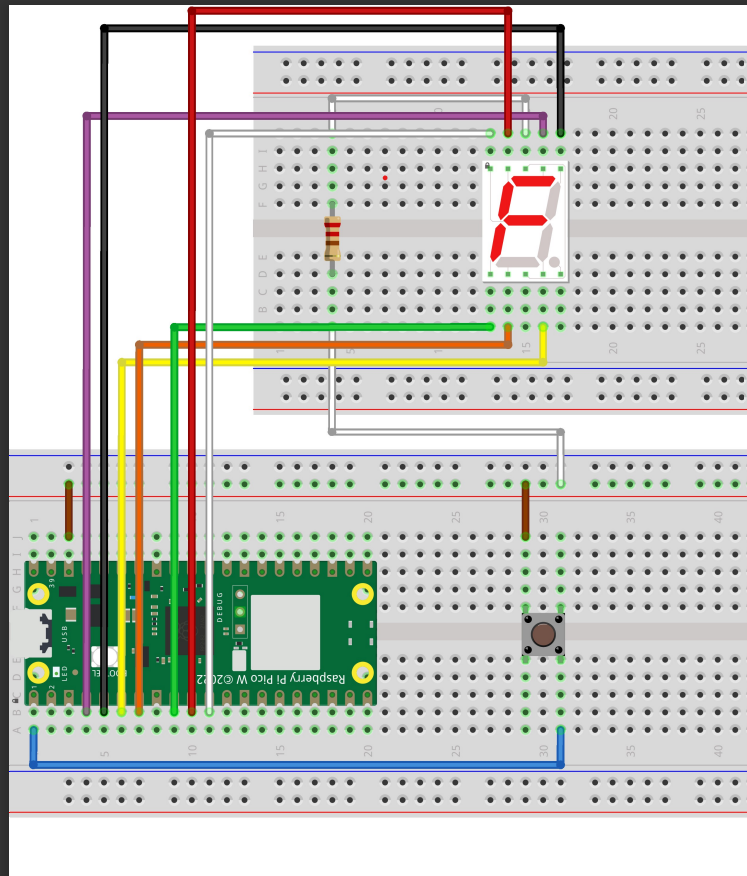

# Integracion Boton inicio/pausa y display - Panel de lavadora

# Implementacion 
Este código en lenguaje C, diseñado para el microcontrolador Raspberry Pi Pico W H, que modularizar el display y boton de inicio/pausa del panel de la lavadora.

# Materiales
Para prototipar el botón de inicio/pausa del display:

1. Raspberry pi pico W H
2. Protoboard
3. Boton DIL Push x1
4. 10 Cables M/M 
5. Display 7 Segmentos x1
6. Resistencia 220 Ohms 5% x1

#  Funcionamiento
Este código implementa un programa para controlar una lavadora mediante Raspberry Pi Pico. Se utiliza un módulo principal: "botonIP.h". El programa inicia inicializando la entrada/salida estándar y los componentes necesarios, como el botón y el display que permite visualizar el tiempo de trabajo de la lavadora. A través de un bucle infinito, el programa verifica si se presiona el botón inicio/pausa y, en caso afirmativo, alterna el estado del display y detiene el contador. 

# Prototipo

Nota:Los GPIO utilizados pueden variar dependiendo como se conecta.

# Pasos
1. Clonar el repositorio.
2. Configurar el CMake.
3. Construir el progrrama uf2.
2. Cablear el prototipo según el ejemplo.
3. Cargar el código en el microcontrolador Raspberry Pi Pico W.
4. Probar el funcionamiento del botón de inicio/pausa.
