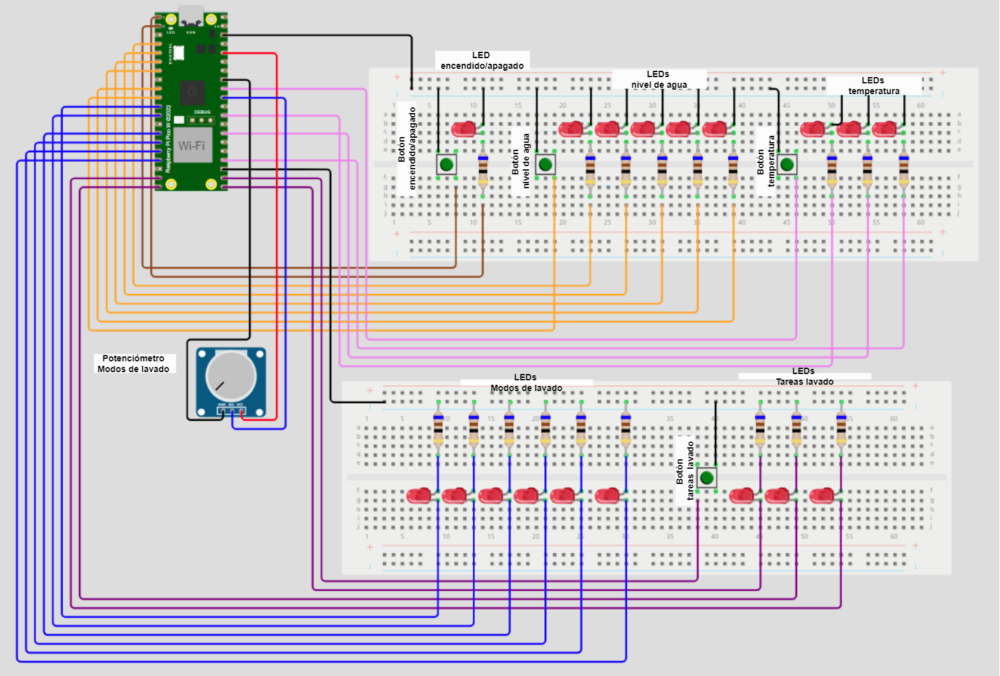

# Panel Lavadora - Main

## Descripcion
Este código es un programa para controlar una lavadora utilizando un microcontrolador compatible con el SDK Pico de Raspberry Pi. El código incluye funciones para inicializar los componentes de hardware, como botones y LEDs, así como para controlar el funcionamiento de un panel de lavadora en función de la interacción del usuario.

## Implementacion

El código implementado en lenguaje C para el microcontrolador Raspberry Pi Pico W H se centra en controlar las funciones básicas de una lavadora. Al iniciar, se inicializan diversos componentes, como el botón de encendido, los LEDs indicadores de nivel de agua, temperatura, tareas de lavado y modos de lavado. Dentro del bucle principal, el programa verifica continuamente el estado del botón de encendido y, si se activa, alterna el estado de la lavadora y actualiza los LEDs correspondientes para reflejar este cambio. Si la lavadora está encendida, el usuario puede ajustar la diversas funcionalidades.

Además, se ha dejado espacio para implementar la función de inicio/pausa del ciclo de lavado, cuya lógica se encuentra desarrollada pero debido a que se agotaron los GPIO no se puede inconporar esa funcionalidad en este codigo. Una vez cargado el programa en la placa Raspberry Pi Pico W H y con el entorno de desarrollo configurado correctamente, los usuarios pueden interactuar con la simulación de la lavadora utilizando el botónes y el potenciómetro para ajustar los parámetros de lavado según sea necesario.

## Componentes

El programa utiliza los siguientes componentes:

- Botón y LED de encendido/apagado: Permite encender y apagar la lavadora y todas las funciones.
- Boton y LEDs de nivel de agua: Permite selecionar el nivel de agua requerido (1-5) niveles.
- Boton y LEDs de temperatura: Permite selecionar la temperatura  para el lavado (1-5) niveles.
- Boton y LEDs de tareas de lavado: Permite selecionar las tareas de lavado (Lavar, Enjuagar, Centrifugar).
- Potenciómetro y LEDs de modos de lavado: Permite selecionar el modo de la lavado(Normal, Lavado Rápido, Delicados, Ropa de Cama, Jeans, Lavado Eco de Tambor).
- Boton Inicio/Pausa: Permite iniciar el proceso de lavado, y ademas puede poner la lavadora en modo pausa para poner elegir otra funcion ya sea nivel de agua, temperatura, etc. 

## Prototipo

## Prototipo Boton inicio/pausa

## Diagrama de flujo

## Materiales
1. Raspberry pi pico W H
2. 2-3 Protoboard
3. 5 Boton DIL Push
4. 60 Cables M/M (Puede variar dependiendo la conexion)
5. 19 LED
6. 15 Resistencia 220 Ohms 5%
7. Display 7 segmentos

## Funcionamiento
El programa se ejecuta en un bucle infinito donde se verifican las interacciones del usuario con el botón de encendido. Cuando se presiona el botón de encendido, se alternará el estado de la lavadora entre encendida y apagada. Además, se controlará el encendido y apagado de los LEDs correspondientes a cada función de la lavadora que son ademas de  la función relacionada con el botón de inicio y pausa de la lavadora. Sin embargo, esta funcionalidad no está completamente implementada en el código actual ademas de Nivel de agua, Temperatura, Tareas de lavado, Modos de lavado.

Si la lavadora está encendida, se le permite al usuario ajustar ciertos parámetros utilizando el potenciómetro o botones para controlar el nivel de agua, temperatura, etc.

## Pasos

1. Ejecutar el código en una IDE ademas de tener instalado el SDK Pico de raspberry pi pico.
2. Conecta los componentes de hardware en base a ejemplo (Prototipo).
3. Compila y carga el programa en tu placa utilizando las herramientas proporcionadas por el SDK Pico.
4. Interactúa con el programa encendiendo la lavadora y  depueste interactua con los botones y potenciómetro según sea necesario.