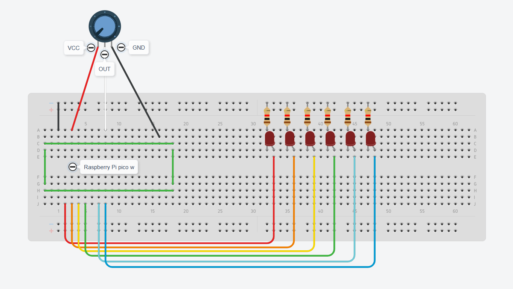
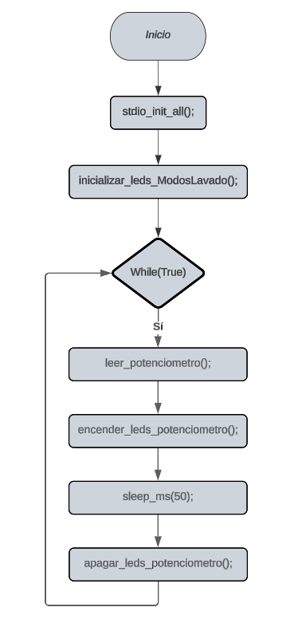

# Seleccionar Modo de Lavado - Panel de Lavadora

## Implementación

Esta funcionalidad lo que permite es seleccionar el modo de lavado mediante un potenciometro por medio de una Raspberry Pi Pico W ela cual encendera y apagará leds, manteniendo encendido el que se quede seleccionado.

## Esquema Fisico

## Funcionamiento

Al energinar la raspberry el programa estará leyendo la entrada analogica del potenciometro, la cual cambiará si es girado este mismo.
Los leds encendidos nos indican los diferentes modos de lavado:
* Normal
* Lavado Rápido
* Delicados
* Ropa de Cama
* Jeans
* Lavado Eco de Tambor

## Diagrama de Flujo del programa modularizado

    

        
    

    

        <h2>Instalación y Uso</h2>
        <ol>
            <li>Clona este repositorio en tu dispositivo.</li>
            <li>Conecta los componentes a la Raspberry Pi Pico W y a la protoboard según el esquema de conexión proporcionado.</li>
            <li>Compila y carga el código en la Raspberry Pi Pico W.</li>
            <li>Gira la perilla del potenciómetro para seleccionar un modo.</li>
        </ol>
    

