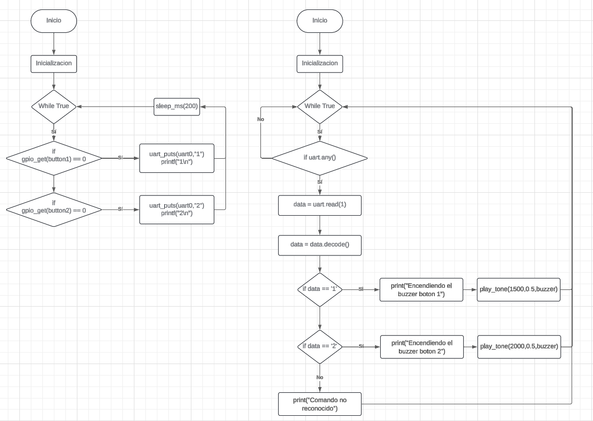

# Zumbador sonidos por boton

## Implementacion

Esta funcionalidad lo que nos permite es que al presionar distintos botones haga el zumbador emita un sonido diferente.

## Esquema fisico

## Funcionamiento

Al cargar el programa en c (**pruebasZumbador.c**), y el programa en python (**./ReceptorPython/main.py**), y al alambrar segun el esquema fisico, cuando se pulsa el boton izquierdo emite un sonido el zumador, y al pulsar el otro boton emite un sonido distinto.

## Diagrama de flujo

## Instalación y Uso

1. Clona este repositorio en tu dispositivo.
2. Conecta los componentes a las Raspberrys Pi Pico W y a la protoboard según el esquema de conexión proporcionado.
3. Compila y carga el código en la Raspberry Pi Pico W C y sube el programa en python.
4. Pulsa cualquier boton para emitir un sonido.